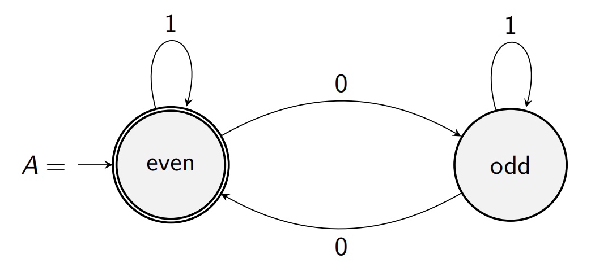

# What?
## [^6:05] How hard is it to solve a given problem?
> Suppose we are given a binary word $w$ such as $101011$, or $0010$, etc.
>
> Let's try to answer:
> 1. Does $w$ contain an even number of $0$s?
> 2. Does $w$ contain an equal number of both $0$s and $1$s?
> 3. Is the number of $0$s in $w$ a prime number?
>
> Let's try to solve them for $w = 0010111010111010110$
>
>
> ### The first question.
>
> You *could* count the number of $0$s, then check if it's even, but this may not scale for giant strings (uses more memory for longer strings).
> A better strategy is to just flip an 'even' flag whenever we see a $0$. This uses a *finite* constant amount of memory (1 bit), and is a simple algorithm. 
>
> ### The second question.
> Here, you could keep a single variable and increment for $0$ and decrement for $1$ and check if the end net result is $0$.
> This strategy uses an *unbounded* amount of memory, but still a reletively 'simple' algorithm.
>
> ### The third question.
> This is probably not solvable in a clever way, so *unbounded* memory and complex program.
>

The first algorithm can be represented as a *finite automaton*.

# Why?
1. Finite automata & RegEx are used everywhere!
2. Context-free languages are important for parses, compilers, and natural language processing.
3. Turing machines are cool, okay?