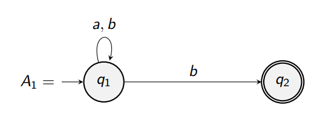
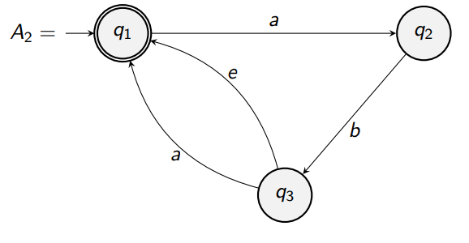

## Properties of a DFA
* Each state has exactly **one arrow** for each letter of the input alphabet.
* At any stage, the next state is **completely determined**.

### Illegal DFA
For example, the following is an *illegal* DFA:

There are two branches for $b$: one that leads to state $q_1$, and one that goes to state $q_2$.

But, what if we *want* it to work?

Well, we have to redefine what computation means here &mdash; we could add a rule to make this automaton work:
> As long as there's some path of computation that ends in an accepting state, accept the state.

This now means that
* $aab$ is accepted.
* $aba$ is not accepted (either still in $q_1$, or cannot read the last $a$ if we are in $q_2$ &mdash; an invalid path).
* $abb$ is also accepted.

We can propose a language that $A_1$ accepts:
$$L_1 = \left\{w\in\left\{a, b\right\}^\ast\Big| w\text{ ends with a }b\right\}$$

### Illegal DFA 2:

**A reminder:** $e$ here does not represent the letter $e$ &mdash; it is not a member of the alphabet! It represents an "empty" string.

In this case, having an empty branch allows us to "jump" from states $q_3$ to $q_1$ where it's convenient (for example, when we're at the end of a string; or when we don't have two $a$s, but have an $ab$ or single $a$).

## Nondeterministic Finite Automaton (NFA)
A nondeterministic finite automaton (NFA) consists of five objects $(Q,\ \Sigma,\ \Delta,\ s,\ F)$ where:
* $Q$ is a finite set of states.
* $\Sigma$ is an alphabet.
* $\Delta \subseteq Q \times \left(\Sigma \cup \left\{e\right\}\right)\times Q$ is the transition relation.
* $s\in Q$ is the initial state.
* $F \subseteq Q$ is the set of accepting states.

**Note:** you may not use all elements of the alphabet in an NFA diagram, so explicitly define your alphabet!

### Computations in NFAs

Let $A = (Q,\ \Sigma,\ \Delta,\ s,\ F)$ be an NFA.

You can interpret NFAs in a couple of ways:

> #### Try out all possible paths
> INPUT: A word $w\in \Sigma^\ast$.
> 1. Start in the initial state.
> 2. Try out all possible ways of reading $w$ left to right, following a path through $A$.
> 3. OUTPUT:
>    * **Accept**: if there's *at least* one path that ends in an accepting state.
>    * **Reject**: if no paths end up in an accepting state.

Or:
> #### Splitting into branches
> INPUT: A word $w\in \Sigma^\ast$.
> 1. Start in the initial state.
> 2. Try out all possible ways of reading $w$ left to right, following a path through $A$.
>   * If there are 2+ transitions possible, split computation into threads for each transition.
>   * If no transitions are possible, kill the current thread as it is a dead end.
> 3. OUTPUT:
>    * **Accept**: if there's *at least* one thread that ends in an accepting state.
>    * **Reject**: if no threads end up in an accepting state.

### Why NFAs?
* It's easier and more expressive to construct than a DFA
* They can always be converted back to DFA anyway, so there's no penalty.