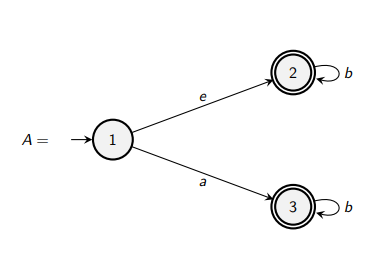

## Differences between NFAs and DFAs

NFAs are more flexible than DFAs:
* They're usually easier to find to accept a language than DFA.
* There are some cool constructions (like a union) that allow for NFAs to be combined.

Although it may seem that NFAs can express more languages than DFAs, this isn't true!

There is a theorem that states:
> Language $L$ is accepted by some NFA if it is accepted by some DFA.
> Therefore, the class of languages that are accepted by NFAs is precisely the regular languages.

In fact, there is an algorithm that can find a corresponding DFA for any language described by an NFA: *The Powerset Construction*.

## The Powerset Construction: An Example
Here, let's  convert the following NFA to a DFA.

First, let's look at the transitions between states.

Here, at $1$, an $a$ will lead us back to $1$, whereas a $b$ can take us either to $1$ or $2$.

For notation's sake, let's make everything members of a set, representing the possible next states under a transition.

Here, in our new combined state $\{1,2\}$, an $a$ can only take us to $1$ again, and $b$ can go to $\{1,2\}$ again.

$$\begin{align*}
    \left\{1\right\} &\overset{a}{\longrightarrow} \left\{1\right\}\\
    \left\{1\right\} &\overset{b}{\longrightarrow} \left\{1, 2\right\}\\\\
    \left\{1, 2\right\} &\overset{a}{\longrightarrow} \left\{1\right\}\\
    \left\{1, 2\right\} &\overset{b}{\longrightarrow} \left\{1, 2\right\}\\
\end{align*}$$

Now, we can see that in our DFA only has two states: $1$ and $1,2$.
To finish, off we need to add designate our start and accepting states.

To choose accepting states, we'll look at which ones involve an accepting state: in our case here, that's $\{1, 2\}$.

### Example 2

Here, there's a jump! This means that we can effectively start from two states $\{1, 2\}$, so let's designate that as our start.

Here, we can use a table to simplify this process, adding states as we encounter them.

If we can't go anywhere, there are no possible destinations under a transition &mdash; an empty set $\emptyset$.
Notice that we can't go anywhere from an empty set, so we're stuck in the empty set &mdash; this is a common pattern that $\empty$ represents a 'dead' state. 

|| $a$ | $b$ |
|-|-|-|
|$\rightarrow\{1,2\}$|$\{3\}$|$\{2\}$|
|$\underline{\underline{\{3\}}}$|$\empty$|$\{3\}$|
|$\empty$|$\empty$|$\empty$|
|$\underline{\underline{\{2\}}}$|$\empty$|$\{2\}$|

So now, we can draw the diagram:

