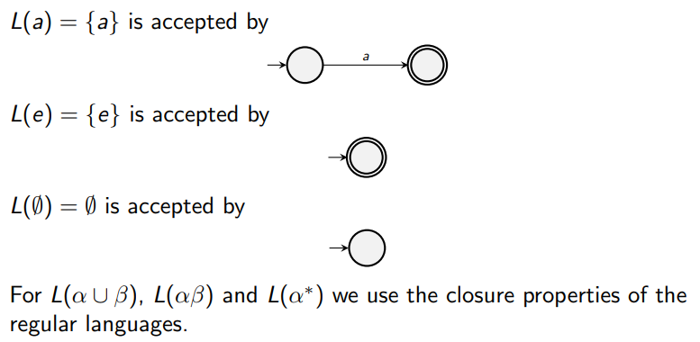

# Regular Expressions
## What are they?
Regular expressions describe patterns:
> Some zeroes, then a one, then either a zero or a one, then finally a zero.

RegEx: $0^\ast1(0 \cup 1)0$

> Either the empty string, or an even number of ones followed by a single zero.

RegEx: $e \cup (11)^\ast0$

You can either go back and forth:

> RegEx: $(010)^\ast \cup (00 \cup 11)^\ast$

Either: the empty string; a sequence of pairs of either ones or zeroes; or repetitions of $010$. 

## Definition

The set $\text{REG}(\Sigma)$ of regular expressions over an alphabet $\Sigma$ is defined by the following inductive rules:
1. $a \in \text{REG}(\Sigma)$ for any $a \in \Sigma$ any element of the alphabet is a regular expression.
2. $e \in \text{REG}(\Sigma)$ &mdash; the empty word is also a regular expression.
3. $\empty \in \text{REG}(\Sigma)$
4. $(\alpha \cup \beta) \in \text{REG}(\Sigma)$ for any $\alpha, \beta \in \text{REG}(\Sigma)$ &mdash; a regular expression can be a union of sub-expressions.
5. $(\alpha \beta) \in \text{REG}(\Sigma)$ for any $\alpha, \beta \in \text{REG}(\Sigma)$ &mdash; a regular expression can be a concatenation of sub-expressions.
6. $(\alpha^\ast) \in \text{REG}(\Sigma)$ for any $\alpha \in \text{REG}(\Sigma)$ &mdash; a regular expression can be a Kleene operation over a sub-expression.

Note that the convention of the order of operations are defined as:
* Kleene $\ast$ first;
* Concatenation $ab$ next;
* Union $a \cup b$ last.

Now, we can define how these regular expressions represent some languages.

## Languages represented by Regular Expressions
Any regular expression $\alpha \in \text{REG}(\Sigma)$ represents a language $L(\alpha) \subseteq \Sigma^\ast$ using the regular operations:
1. $L(a) = \{a\}$ &mdash; regex '$a$; defines a language that only accepts a single $a$.
2. $L(e) = \{e\}$ &mdash; regular expression that accepts the empty word.
3. $L(\emptyset) = \emptyset$ &mdash; the empty language (a language without words).
4. $L(\alpha \cup \beta) = L(\alpha) \cup L(\beta)$
5. $L(\alpha\beta) = L(\alpha)L(\beta)$
6. $L(\alpha^\ast) = L(\alpha)^\ast$

## Putting it all together

* Now that we've defined RegExs, we have a class of languages that can be represented by Regular Expressions. 

* If a language is accepted by a finite automaton, it's called *regular*.

### Theorem
> The regular languages are *exactly* those languages that can be represented by a regilar expression.

This theorem connects the abstract computational world of finite automata and the practicality of pattern matching of regular expressions.

Proving it needs two things to be true:
1. For any regular expression $\alpha$ the language $L(\alpha)$ is regular.
2. For any regular language $X$ accepted by some finite automaton, we can find a regular expression $\alpha$ such that $X = L(\alpha)$

#### Converting RegEx to Regular Languages

