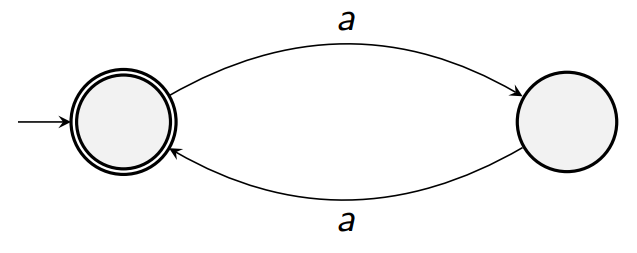
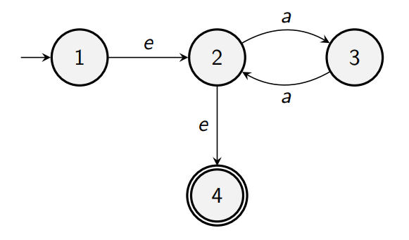
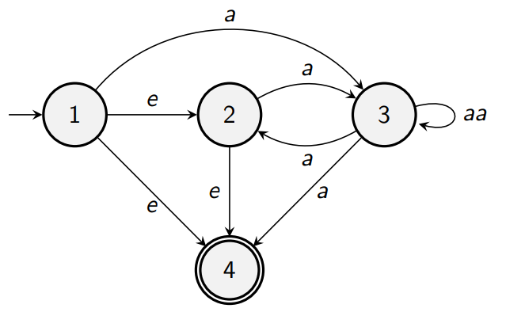

## Converting Finite Automata to RegEx

Now that we know that we can convert NFA/DFAs to RegEx, let's go through an algorithm to do this!

0. Start with a DFA/NFA
    
1. We need to pre-process it a bit:
    
    A. We need to make the initial state have no incoming arrows (from other states).

    B. The accepting state must not have any arrows, and there can only be one accepting state (link multiple accepting states via jumps).

    

2. Next is the iterative bit:
    A. Choose an intermediate point.
    B. Find all possible paths (of length 2) going through it (where it is a middle point).
    Figure out what the combined regular expression is for this path.
    