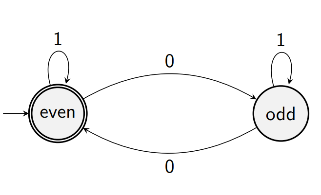

# The Pumping Lemma

Or more intuitively, "the looping theorem".

## An example: An infinite Automaton
What if we were to find a finite automaton that describes the language $L$, where L is defined:
$$L = \big\{w \in \{a,b\}\ \big|\ w \text{ has an equal number of } a \text{s and } b \text s\big\}$$

Well, we'd need to keep track of the difference of $a$s and $b$s (here, well use $a$ as $+1$ and $b$ as $-1$):

### A Theorem: Not all languages are Regular
We've found a language that requires an automaton to have infinite states!
This means it cannot be represented by ant finite automaton, therefore it can't be a regular language.

## How to prove that a language $L$ is not regular?
Ideally, we need a common property that all regular languages have and show that $L$ doesn't have this property.

It turns out this property is that:
> All sufficiently long words in the language can be *"pumped"*.

The concept that all regular languages satisfy the above is called the *pumping lemma* for regular languages*.

*Lemma &mdash; a subsidiary or intermediate theorem in an argument or proof. A 'stepping stone', if you will.

But what is pumping?

### "Pumping"

Suppose that $L$ is now a *regular language*, and is accepted by some *DFA* $A$.

Now, let's pick a word $w \in L$ where $\big|w\big| \geq \text{states in A}$. 

We can now trace $w$'s route through $A$, and see that it must go through a loop at least once*.

For example, here there are three loops: $(\text{even} \overset{1}{\rightarrow} \text{even}),\ (\text{even} \overset{1}{\rightarrow} \text{odd}),\ (\text{even} \overset{0}{\rightarrow} \text{odd} \overset{0}{\rightarrow} \text{even})$.

Mathematically, we can express these words in the form $xy^nz$ where $x$ is the bit before the looping, $y$ is the looping portion ($n\in\Z^+, n \geq 1$), and $z$ is the bit after the looping.

Note that $x$ and $z$ can be empty words, but $y$ cannot.

*Note: there is a stipulation &mdash; the word must be sufficiently long enough to be pumped.

### The Informal Description
> Let $L$ be regular language. There's a special number $n$ called the *pumping length*,
> such that any word $w$ with $\big|w\big| \geq n$ :
>
> 1. contains a (nonempty) loop
> 2. the loop can be found in the first $n$ letters of the word
> 3. the loop can be pumped an arbitrary number of times and still produce a word in $L$.

### The Full Description
> In any regular language $L$, there is a number $n$, called the *pumping length*, such that any word $w \in L$ with $\big|w\big| \geq n$ can be divided into $3$ pieces $w = xyz$ such that:
> 1. $y \neq e$ &mdash; $y$ is a nonempty loop.
> 2. $\big|xy\big| \leq n$ &mdash; the loop can be found in the first $n$ letters of $w$
> $xy^iz \in L$ for all $i = 0, 1, 2 \dots$ &mdash; the loop can be pumped an arbitrary number of times and the resultant word is still in $L$.