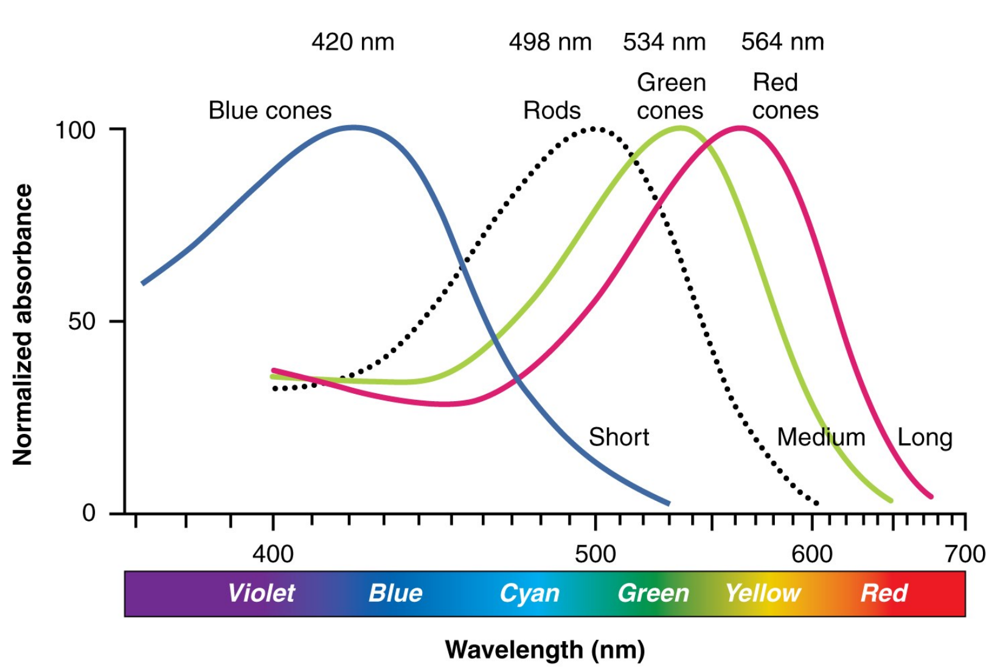
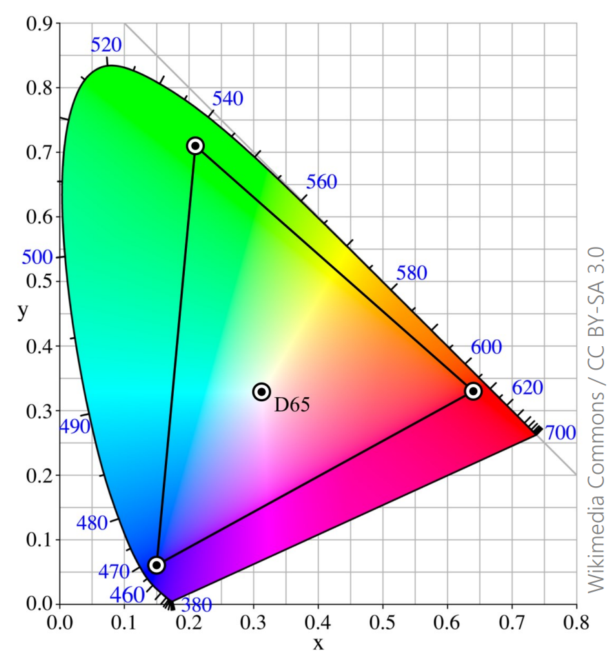

# Colors 

## Colors in Real Life

Light emitted from a source is usually a *spectral distribution* of energy (unless it is a laser), which means that energy is distributed across multiple wavelengths. 

Then, when light is reflected off a surface, that too is governed by a spectral distribution.

These two spectra from the original light's (the incident) spectrum and the surface's reflectance spectrum determine the final colour of the light from the surface. 

## Our Perception of Colour
### Color Constancy

This refers to the fact that we can often perceive the same color as two different colors based on only the surrounding context.

[See more on Wikipedia.](https://en.wikipedia.org/wiki/Color_constancy)

### Cones and Rods

Our vision is trichromatic (we can see combinations of three colors) due to the three different types of *cone* cells in our eyes.

The cones in our eyes are sensitive to various wavelengths in the visible spectrum:
* long (near red),
* medium (near green),
* short (near blue)

As such, we can't 'see' the full visible spectrum of light &mdash; when we make displays, we will focus on catering to these three main colours, as creating arbitrary spectral distributions wouldn't be worth it (we can't tell the difference anyway).

Rods are mainly used for low-light environments (such as night) as there are many more of them compared to cone cells (~120 million rods vs ~6 million cones) &mdash; though because of this fact, colour perception is severely limited because of the difference in numbers of cones compared to rods.

## Digital Color

### The RGB Color Model
From, biology we know that humans can only perceive colours in terms
of red, green, and blue wavelengths &mdash; colour models make use of this by emitting red, green, and blue wavelengths from digital displays.

RGB is fairly good at covering visible colours (see the picture below).  

### Additive vs. Subtractive Colour
*Additive* primary colours are used in displays and lighting &mdash; where light is being emitted from a source.

*Subtractive* primary colours are used for painting and printing &mdash; where light is reflected off a surface.

### CMY(K)

CMY(K) &mdash; (Cyan Magenta Yellow [and Key (Black)]) are a subtractive colour space. Black is usually added to help accurately print pure black (otherwise, you'd get a muddy grey!) and save ink/money.

### Greyscale

Greyscale images do not have any colour, but do have different shades of grey.

Human vision biases green as a bright colour as seen by the weights of the various colour components in this 'lightness' function:
$$l\left(r,g,b\right) = 0.2126r + 0.7152g + 0.0722b$$

### Colour Spaces

Colour spaces concern about how to represent colours. Common colour spaces include:
* RGB
* CMYK
* HSV/HSL (Hue, Saturation, Value/Lightness)

## Digital Images

Digital images are 2D samples of some continuous function (the spectra of light in a real scene).

### Pixels
These samples are called picture elements (or **pixels** for short), which are the smallest piece of information in a digital image.

One pixel will contain all of the colour data for itself (usually represented with RGB values).

### Rasterisation
Rasterisation is the process of converting continuous (or vector images) into a rectangular grid of pixels (or a 'bitmap').

This is done when drawing vector graphics (to screens with pixels) and in digital cameras' [sensors](https://en.wikipedia.org/wiki/Active-pixel_sensor).

### Storage
Digital images are stored in *scanline* order:
* Pixels from left to right (per row)
* Rows from top to bottom

In general, this is 
$$\text{bytes per pixel} \times \left(\text{row} \times \text{image width} + \text{column index}\right)$$
* for 8-bit greyscale, $\text{bytes per pixel} = 1$ 
* for 8-bit RGB, $\text{bytes per pixel} = 3$ 
* for 8-bit RGBA (RGB + 'Alpha' for opacity), $\text{bytes per pixel} = 4$

For colour formats, each pixel will have multiple "channels" to store the red, green, and blue values.

