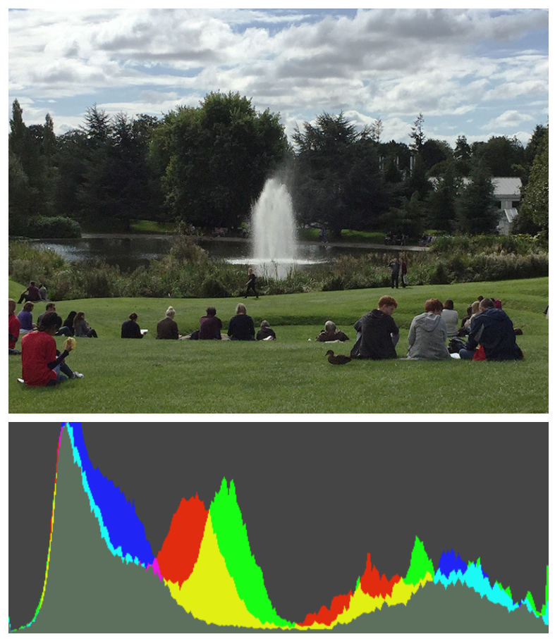
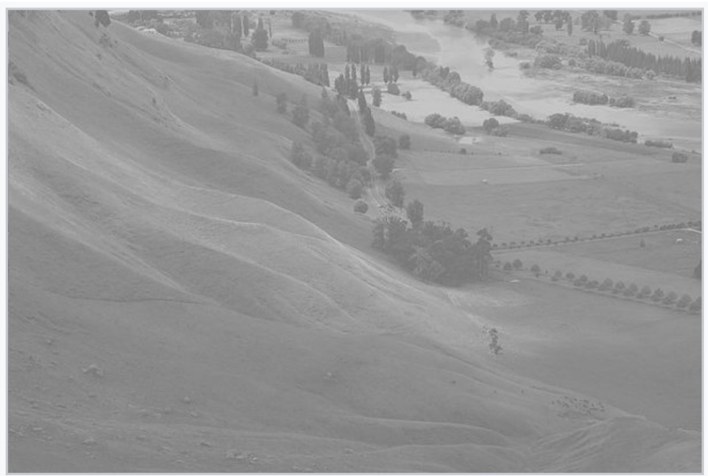

## How can we make filters?
Well, filters can be thought of functions on pixel values &mdash; some operate on sing values, some will operate on multiple at once. 

### Examples
|Name|Definition|Description|
|----|----------|-----------|
|Enhance Brightness|$\text{img}[x,y] := \min(\text{img}[x,y] + k, 255)$| Makes image brighter.|
|Inversion|$\text{img}[x,y] := 255 - \text{img}[x,y]$|Inverts colours.|
|Contrast|$\text{img}[x,y] := \left[\frac{\text{img}[x,y] - 51}{0.6}\right]_{0}^{255}$|Increases contrast between light and darks colours.|

## Image Histograms
We can better apply these filters by gaining additional information about the image &mdash; an *image histogram* tells us about the distribution of intensity values in the image (how many pixels are a certain brightness).

### Histogram Equalisation
Here, this starting image would have a narrow histogram.

If we widen this histogram
