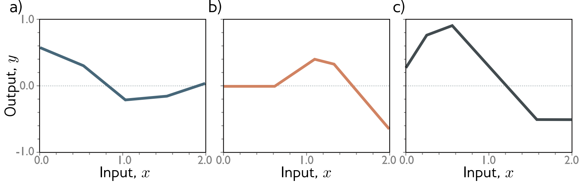
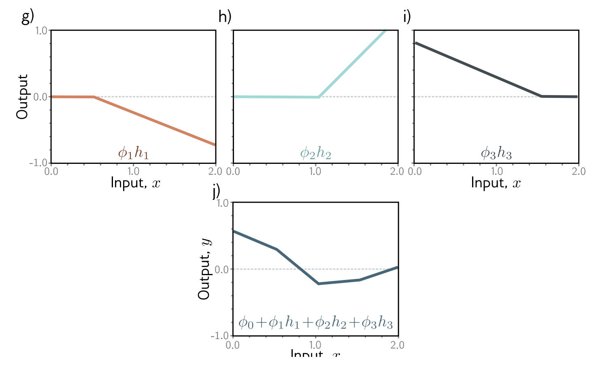
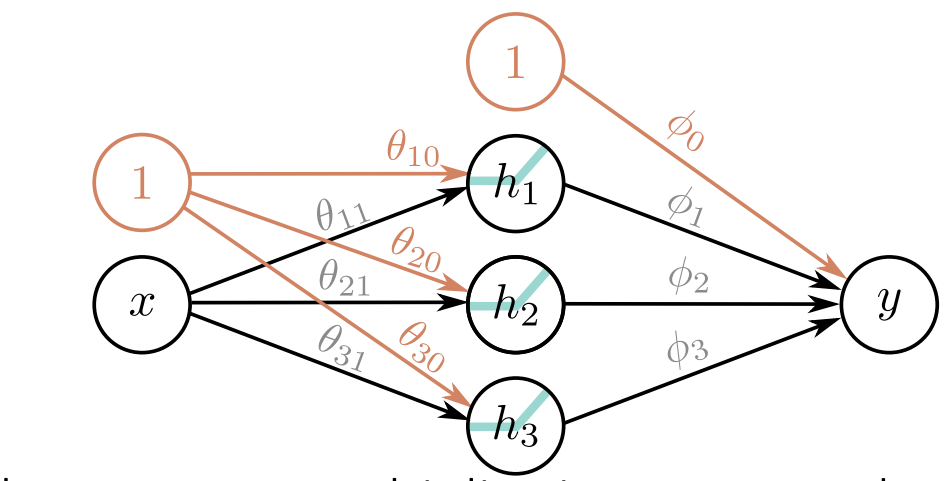
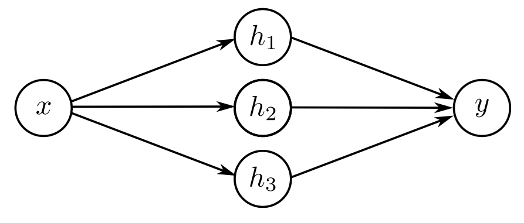
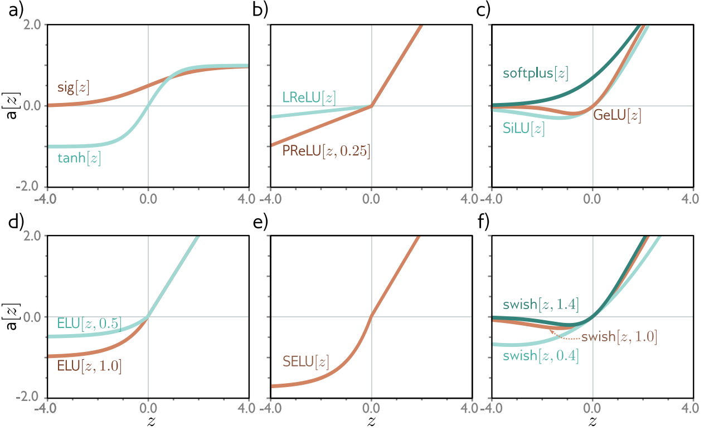

We've covered 1D regression models, but what if we want an arbitrary number of inputs and outputs?

Enter, the Shallow Neural Network.

### Example Shallow Network

$$\begin{align*}
    y &= \mathrm f\left[x, \phi\right]\\
      &= \phi_0 + \phi_1\mathrm a \left[\theta_{10} + \theta_{11}x\right] + \phi_2\mathrm a \left[\theta_{20} + \theta_{21}x\right] + \phi_3\mathrm a \left[\theta_{30} + \theta_{31}x\right]
\end{align*}$$

#### Aside: Activation Functions

Here, $\mathrm a$ is known as the *activation function*. An example of an activation function is the Rectified Linear Unit defined as:
$$\mathrm{ReLU}\left[z\right] = \begin{cases}
    0&z<0\\
    z&z\geq 0
\end{cases}$$ 

$\mathrm{ReLU}\left[z\right]$ essentially returns $0$ for all negatives, and its input for non-negatives (including $0$!)

#### Parameters

This example model has 10 parameters:

$$\mathbf{\phi} = \left\{\phi_0, \phi_1, \phi_3, \theta_{10}, \theta_{11}, \theta_{20}, \theta_{21}, \theta_{30}, \theta_{31}\right\}$$

#### What's it represent?

This example model represents piecewise linear functions with three joints.

#### Hidden Units
We can represent this model by 'hiding' the three constituent units (represented as $h$'s here):
$$y = \phi_0 + \phi_1h_1 + \phi_2h_2 + \phi_3h_3$$

These are often drawn as:

Here, the input $1$ is multiplied by parameter $\theta_{10}$, then added to the rest of the incoming arrows.

Usually, the orange things are emitted for brevity:

#### Activation Pattern

This is just which units are active under a particular $x$ value.

#### Arbitrary hidden units

$$h_d = \mathrm a \left[\theta_{d0} + \theta_{d1}x\right]$$

$$y = \phi_0 + \sum_{d=1}^D\phi_dh_d$$

With enough hidden units, one can describe any 1D function to an arbitrary accuracy.

This concept is succinctly put in the **Universal Approximation Theorem** which states that a shallow neural network can describe any continuous function on a compact subset of $\R^D$ to arbitrary precision.

#### Multiple Inputs

We can give our model multiple inputs like so:
$$h_d = \mathrm a \left[\theta_{d0} + \sum_{i=1}^{D_i}\theta_{di}x_i\right]$$

We essentially just keep adding $x$'s along with weights to accompany them.

#### Multiple Outputs

We can give our model multiple outputs by using different weights for $\phi$:
$$y_j = \phi_{j0} + \sum_{i=1}^{D_O}\phi_{jd}h_d$$

## Terminology
| Term | Definition |
|-|-|
|Biases| Y-offsets | 
|Weights| Slopes on $X_i$|
|Fully-connected networks| Everything in a layer are connected to everything in the next. |
|Feedforward network| No loops in the network.|
|Activations| Resultant values after applying a $\text{ReLU}$.|
|Pre-activations| Values before after applying a $\text{ReLU}$. |
|Shallow Neural Network| $1$ Hidden Layer. |
|Deep Neural Network| $\gt 1$ Hidden Layer. |

## Other Activation Functions

## Moving On 
We can accept any number of inputs, outputs, and hidden units &mdash;
but what if we were to also increase the number of hidden layers?

