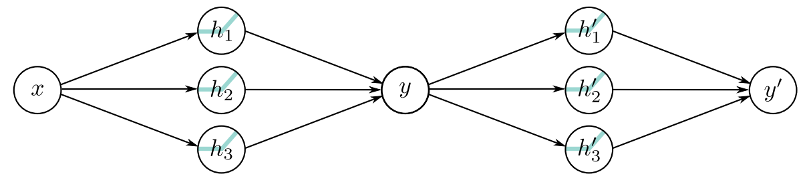

## Deep Neural Networks

* These are neural networks with more than one hidden layer (one hidden layer feeds into the next). 

### Combining two Shallow Networks

What if we were to combine two shallow networks?

We can describe this using the same maths as before:

$$\left.\begin{array}{l l}
    h_1 &= \text a \left[\theta_{10} + \theta_{11}x\right]\\
    h_2 &= \text a \left[\theta_{20} + \theta_{21}x\right]\\
    h_3 &= \text a \left[\theta_{30} + \theta_{31}x\right]\\
    y &= \phi_0 + \phi_1 h_1 + \phi_2 h_2 + \phi_3 h_3 
\end{array}\ \right\}\text{ First network}$$

$$\left.\begin{array}{l l}
    h^\prime_1 &= \text a \left[\theta^\prime_{10} + \theta^\prime_{11}y\right]\\
    h^\prime_2 &= \text a \left[\theta^\prime_{20} + \theta^\prime_{21}y\right]\\
    h^\prime_3 &= \text a \left[\theta^\prime_{30} + \theta^\prime_{31}y\right]\\
    y^\prime &= \phi^\prime_0 +^\prime \phi^\prime_1 h^\prime_1 + \phi^\prime_2 h^\prime_2 + \phi^\prime_3 h_3 
\end{array}\right\} \text{ Second network}$$

Then, when we substitute $y$ into the second network's hidden layer.

$$\left.\begin{array}{l l}
    h^\prime_1 &= \text a \left[\theta^\prime_{10} + \theta^\prime_{11}\phi_0 + \theta^\prime_{11}\phi_1 h_1 + \theta^\prime_{11}\phi_2 h_2 + \theta^\prime_{11}\phi_3 h_3 \right]\\
    h^\prime_2 &= \text a \left[\theta^\prime_{20} + \theta^\prime_{21}\phi_0 + \theta^\prime_{21}\phi_1 h_1 + \theta^\prime_{21}\phi_2 h_2 + \theta^\prime_{21}\phi_3 h_3\right]\\
    h^\prime_3 &= \text a \left[\theta^\prime_{30} + \theta^\prime_{31}\theta^\prime_{31}\phi_0 + \theta^\prime_{31}\phi_1 h_1 + \theta^\prime_{31}\phi_2 h_2 + \theta^\prime_{31}\phi_3 h_3\right]\\
\end{array}\right\} \text{ Second network}$$

But what if we were to generalise this concept? Let's replace all our existing paramteres with $\psi$: 

$$\left.\begin{array}{l l}
    h^\prime_1 &= \text a \left[\psi_{10} + \psi_{11}h_1 + \psi_{12}h_2 + \psi_{13}h_3\right]\\
    h^\prime_2 &= \text a \left[\psi_{20} + \psi_{21}h_1 + \psi_{22}h_2 + \psi_{23}h_3\right]\\
    h^\prime_3 &= \text a \left[\psi_{30} + \psi_{31}h_1 + \psi_{32}h_2 + \psi_{33}h_3\right]\\
    y^\prime &= \phi^\prime_0 +^\prime \phi^\prime_1 h^\prime_1 + \phi^\prime_2 h^\prime_2 + \phi^\prime_3 h_3 
\end{array}\right\} \text{ A new dual-layer network }$$

We've suddenly made a dual-layer neural network!

### Hyperparameters

Now that we can have multiple layers, we have more things we can change about our network:
* Number of hidden layers $K$ &mdash; the 'depth' of the network.
* Number of hidden units for layer $k$, $D_k$ &mdash; the width of the width of the network.

We call these properties *hyperparameters* &mdash; things we choose before training a network. 

There's not a great mathematically-defined way to find the best hyperparameters yet, so finding them is a matter of trial and error (with some tricks albeit).

## Notation

Now that we have multiple layers, we'll have multiplicatively more terms, so we'll start to use vectors and matrices instead of subscripts.

**Note**: Anything that operates on a vector/matrix, or is a vector/matrix shall be shown in **bold**.

$$\underset{\text{Hidden Layer } 1}{\mathbf h_1} = \mathbf a\left[\underset{\text{Bias vectors}}{\mathbf\beta_0} + \underset{\text{Weights matrix}}{\mathbf\Omega_0}\ \mathbf x\right]$$

Notice as well that in general for $0 < k < K$:

$$\mathbf h_k = \mathbf a \left[\mathbf\beta_{k-1} + \mathbf\Omega_{k-1}\mathbf h_{k-1}\right]$$

You could think of $\mathbf h_0$ as 'equalling' $\mathbf x$.

Remember:
* Our weights $\mathbf\Omega$ are what we multiply by (Matrix).
* Our biases $\mathbf\beta$ are what we add (Vector).

### Why deep networks?
1. They both approximate functions (The Approximation theorem still applies to deep networks).
2. You get more regions per parameter with a deep network.
    * The weird symmetry doesn't seem to matter that much in practice. Somehow?
3. Depth efficiency &mdash; some functions require exponentially more hidden units to be created by a shallow network as compared to a deep network implementation. This is known as *depth efficiency*.
4. Large structured networks &mdash; it's not practical to have fully-connected networks for applications such as images, and having weights that operate locally needs multiple layers. This technique is heavily used in convolutional networks.
5. It's easier to fit models with up to 20 layers, after which you'll need some tricks. In general, it takes less time to train deep networks.