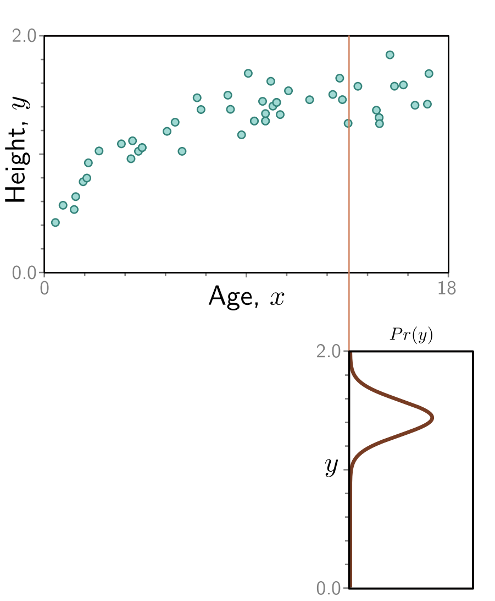

## Generalisation of Models
Instead of just predicting a continuous output variable $y$, what if we instead output a probability distribution of $y$ ($\text{Pr}(y)$) describing the probability of getting any output $y$ under the input $x$.

We can pick certain distributions to fit our needs (such as a Normal, or Poisson distribution).
This distribution is controlled by parameters $\theta$ found during training.

So it may be slightly clearer to say that our model predicts the likelihood of $y$ given an input $x$.
In an ideal world, we want out model to be as certain as possible (maximum probability), that is:

$$\begin{align*}\underset{{\text{Ideal parameters}}}{\hat{\mathbf\phi}} &= \argmax_\phi\left[\prod_{i=1}^I \Pr(\mathbf y_i | \mathbf x_i)\right]\\&=\argmax_\phi\left[\prod_{i=1}^I\text{Pr}(\mathbf y_i | \mathbf f [\mathbf x_i, \mathbf\phi])\right]\end{align*}$$

Here, our formula for our ideal parameters assumes all the inputs are independent of each other.

Unfortunately, the terms in the product can be very very small, which can lead to floating point errors and a problem with binary representation.

A solution to this is to use $\log z$:
* $\log$ is monotonic &mdash; when $z$ goes up, so does $\log z$.
* It keeps all the peaks and troths in the same place (this is very important), but 'squishes' the graph.

Using $\log$ we can now get a new maximum likelihood equation:

$$\begin{align*}\underset{{\text{Ideal parameters}}}{\hat{\mathbf\phi}} &= \argmax_\phi\left[\log \left(\prod_{i=1}^I \Pr(\mathbf y_i | \mathbf x_i)\right)\right]\\&=\argmax_\phi\left[\sum_{i=1}^I\log\left[\text{Pr}\left(\mathbf y_i | \mathbf f [\mathbf x_i, \mathbf\phi]\right)\right]\right]\end{align*}$$

This is waaay better than multiplication since the small size of our terms doesn't matter nearly as much.

By convention, we'll change this maximization problem into a minimization problem:

$$\begin{align*}
\hat{\mathbf \phi}
    &= \argmin_\phi\left[-\sum_{i=1}^I \log \left[\Pr\left(\mathbf{y}_i | f[]\right)]\right] \\
    &= \argmin_\phi \left[\text{L} \left[\phi\right]\right]
\end{align*}$$