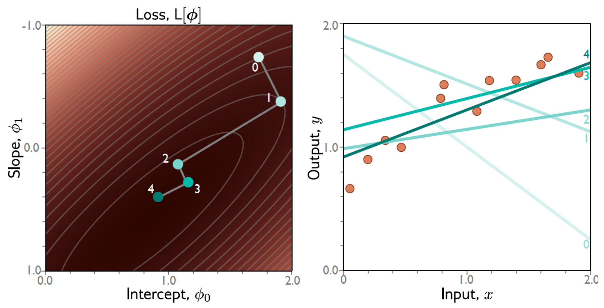
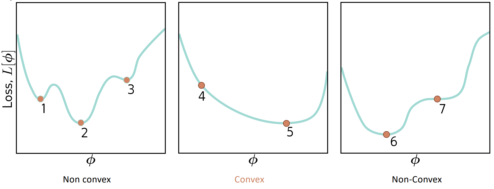
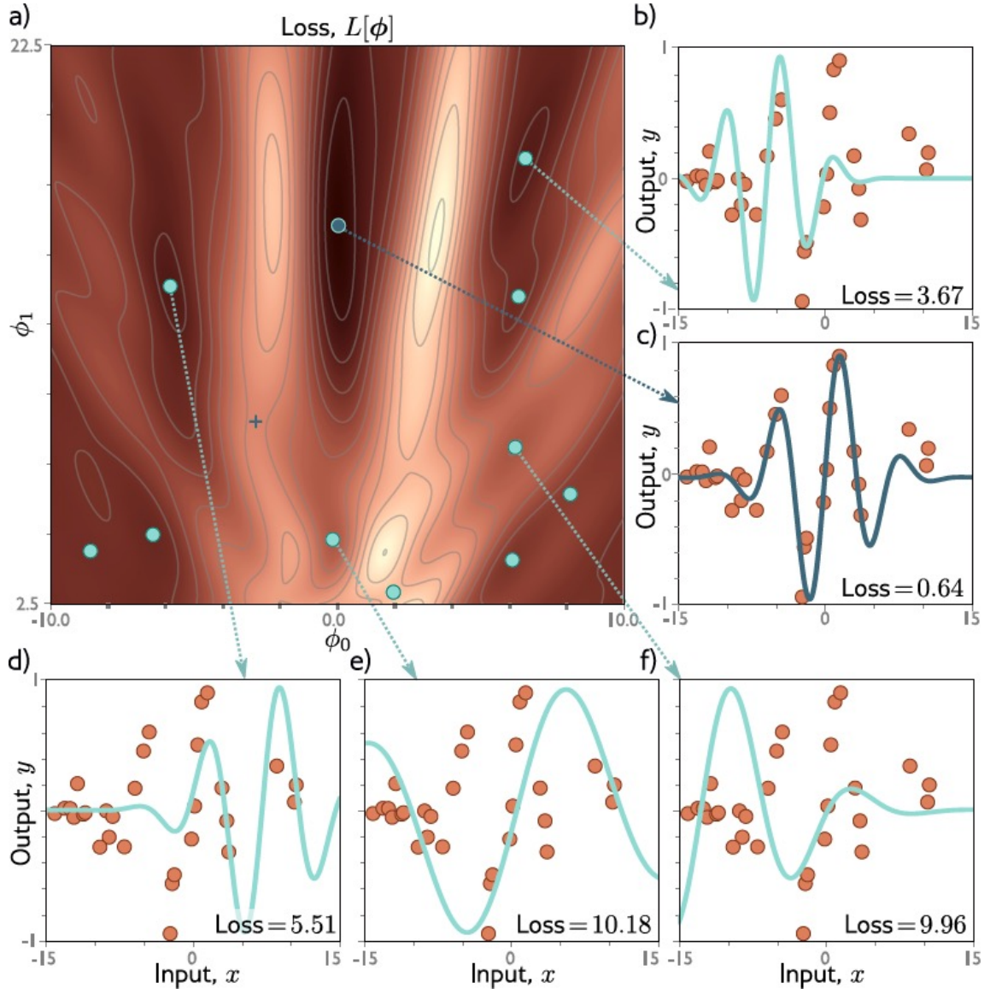
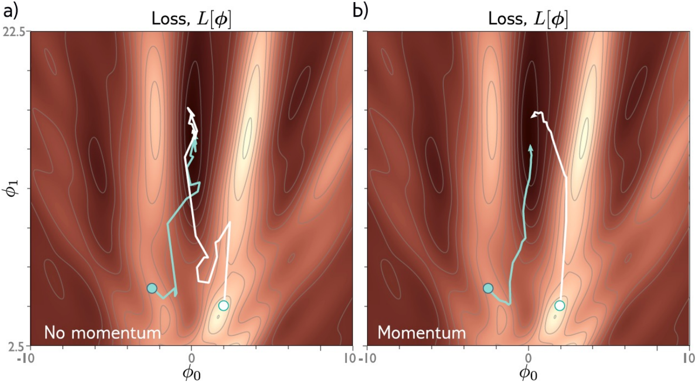
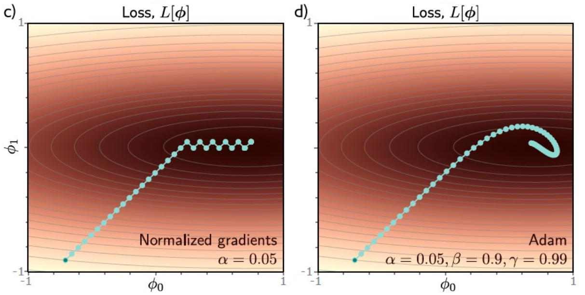

# Fitting Models

Here, we'll use the concept of derivatives to help us find the ideal parameters for our own model.

## Gradient Descent Algorithm

1. Compute derivatives with respect to parameters:
    $$\frac{\partial L}{\partial \boldsymbol{\phi}} = \left[\begin{matrix}
        \vphantom{\bigg[]}
        \frac{\partial L}{\partial \theta_0}\\
        \vphantom{\bigg[]}
        \frac{\partial L}{\partial \theta_1}\\
        \vdots\\
        \vphantom{\bigg[]}
        \frac{\partial L}{\partial \theta_n}\\
    \end{matrix}\right]$$
2. Update the parameters according to:
    $$\boldsymbol\phi \leftarrow \boldsymbol\phi - \alpha \frac{\partial L}{\partial \boldsymbol{\phi}}$$

3. Stop when the gradient is small enough.

Note that when $\alpha$ is fixed, it's known as the *learning rate*.

Because of the minus sign, we are going 'downhill'.

Here is an example of the algorithm operating on a 2 parameter model:

### Bracketing

Choosing a value of $\alpha$ can be done using a very simple method known as *bracketing*.

1. We'll choose two points on a graph, and further subdivide them with two more midpoints (4 total sections).
2. We'll choose the highest-valued of these two midpoints to be the start of our new interval, 
3. Eventually, we'll get a minimum point (may not be the global minimum, though!)

### Local Minima

However, this does not work for all types of loss functions.

For example, non-convex (concave) functions:

Here, points that have a gradient of zero are not guaranteed to be the *global* minimum, or even a minimum at all (point of inflection)!

### Stochastic Gradient Descent
Here, we add noise to hope that we can jump from some of the local minima to another place (like a global minimum if we're lucky!)

The idea is to compute the gradient based on only a *subset* of the available points, which are picked randomly. After we use a subset of points, we then take them out of the dataset &mdash; so we effectively sample different subsets every time.

One pass through the dataset is called an *epoch*. 

Here, our updated parameters are according to:

$$\boldsymbol\phi_{t+1} \leftarrow \boldsymbol\phi_t - \alpha \sum_{i\in\mathcal B_t}^I\frac{\partial \ell_i[\boldsymbol\phi_{t}]}{\partial \boldsymbol{\phi}}$$

Instead of:

$$\boldsymbol\phi_{t+1} \leftarrow \boldsymbol\phi_t - \alpha \sum_{i=1}^I\frac{\partial \ell_i[\boldsymbol\phi_{t}]}{\partial \boldsymbol{\phi}}$$

Where $\mathcal B_t$ is the subset of the dataset used at time $t$.

#### Properties
**Advantages**
* Can escape from local minima
* Adds noise, but still updates sensibly (not flying around all over).
* Uses all data equally.
* Less expensive computationally
* Seems to find better solutions

**Disadvantages**
* Doesn't converge traditionally.
    
    To combat this, we can use a *learning rate schedule* to decrease $\alpha$ over time to eventually make it settle. 

### Momentum
Here, we can add the concept of 'momentum' to our stochastic approach, where the gradient $\textbf m$ we follow at time $t$ depends on the previous gradient at $t-1$:

$$\textbf m_{t+1} \leftarrow \beta \cdot \textbf m_t + (1 - \beta) \sum_{i\in \mathcal{B}_t} \frac{\partial \ell\big[\boldsymbol{\phi_t}\big]}{\partial \boldsymbol\phi}$$

Here, the weight $\beta$ determines how important the previous gradient was.

Now that we have $\textbf m$ defined, we can follow the usual stochastic gradient descent algorithm, replacing the existing gradient with $\textbf m$.  

$$\boldsymbol\phi_{t+1} \leftarrow \boldsymbol\phi_t - \alpha \cdot \textbf m_{t+1}$$

### Nestrov Accelerated Momentum

This is a slightly different approach where we define momentum slightly differently: we 'predict' the direction, move, and then measure the gradient.

$$\textbf m_{t+1} \leftarrow \beta \cdot \textbf m_t + (1 - \beta)\sum_{i\in\mathcal B_t}\frac{\partial \ell_i[\boldsymbol\phi_t - \alpha \cdot \textbf m_t]}{\partial \boldsymbol\phi}$$

### Adaptive Moment Estimation (Adam)
A more complicated algorithm.

So here, we measure the mean $\textbf m$ and the pointwise squared gradient $\textbf v$:

$$\textbf m_{t+1} \leftarrow \frac{\partial L[\phi_t]}{\partial\boldsymbol\phi}$$
$$\textbf v_{t+1} \leftarrow \frac{\partial L[\phi_t]^2}{\partial\boldsymbol\phi}$$

Then, we can use both to normalise the gradient or stochastic gradient descent algorithm uses:

$$\boldsymbol\phi_{t+1} \leftarrow \boldsymbol\phi_t - \alpha \cdot \frac{\textbf m_{t+1}}{\sqrt{\textbf v_{t+1}}+ \epsilon}$$

#### Adding in Momentum

$$\textbf m_{t+1} \leftarrow \beta \cdot \textbf m_t + (1 - \beta)\frac{\partial L[\boldsymbol\phi_t]}{\partial\boldsymbol\phi}$$

$$\textbf v_{t+1} \leftarrow \gamma \cdot \textbf v_t + (1 - \gamma)\left(\frac{\partial L[\boldsymbol\phi_t]}{\partial\boldsymbol\phi}\right)^2$$

Here, we 'moderate' near the start of the sequence (to 'cool' it down):

$$\tilde{\textbf m}_{t+1} \leftarrow \frac{\textbf m_{t+1}}{1 - \beta^{t+1}}$$
$$\tilde{\textbf v}_{t+1} \leftarrow \frac{\textbf v_{t+1}}{1 - \gamma^{t+1}}$$

Note that $\beta$ and $\gamma$ serve the same purpose as $\beta$ (how important the past value was). 

