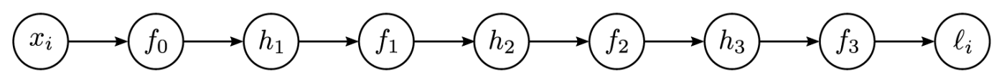

# Problems

## 1. Gradient Calculation
So, what about applying the stochastic descent algorithm?

We need to calculate lots of gradients for parameters, for biases, for each point, for each iteration (epoch).

## 2. Initialisation
Where do we start our parameters before applying stochastic gradient descent?

# Solutions
## "Backpropagation Algorithm"

Rumelhart, Hinton, and Williams (1986) published an algorithm to compute gradients effectively.

### The Forwards Pass
Here, we're looking at how one small change affects the rest of the model.

To figure out how a change to a weight/bias into $\textbf h_1$ can modify the loss, we'd need to know:
* How $\textbf h_1$ affects $\textbf h_2$
* How $\textbf h_2$ affects $\textbf h_3$
* How $\textbf h_4$ affects the output
* How the output affects the loss.

### An Example

$$\mathrm f [x, \boldsymbol\phi] = \beta_3 + \omega_3 \cdot \cos \Big[\beta_2 + \omega_2 \cdot \exp \big[\beta_1 + \omega_1 \cdot \sin[\beta_0 + \omega_0 \cdot x]\big]\Big]$$

$$\ell = \left(\mathrm f[x_i, \boldsymbol\phi] - y_i\right)^2$$

Here, our activation functions are $\sin, \cos, \exp$.

We ideally want to calculate:

$$\frac{\partial \ell_i}{\partial \beta_0},\frac{\partial \ell_i}{\partial \omega_0},\frac{\partial \ell_i}{\partial \beta_1},\frac{\partial \ell_i}{\partial \omega_1},\frac{\partial \ell_i}{\partial \beta_2},\frac{\partial \ell_i}{\partial \omega_2},\frac{\partial \ell_i}{\partial \beta_3}, \text{ and } \frac{\partial \ell_i}{\partial \omega_3}$$

Instead of calculating the entire thing, we can express our model as a bunch of smaller models.

$$\begin{array}{ll}
    f_0 = \beta_0 + \omega_0 \cdot x_i & h_1 = \sin[f_0]\\
    f_1 = \beta_1 + \omega_1 \cdot h_1 & h_2 = \exp[f_1]\\
    f_2 = \beta_2 + \omega_2 \cdot h_2 & h_3 = \cos[f_2]\\
    f_3 = \beta_3 + \omega_3 \cdot h_3 & \ell = \left(f_3 - y_i\right)^2
\end{array}$$

